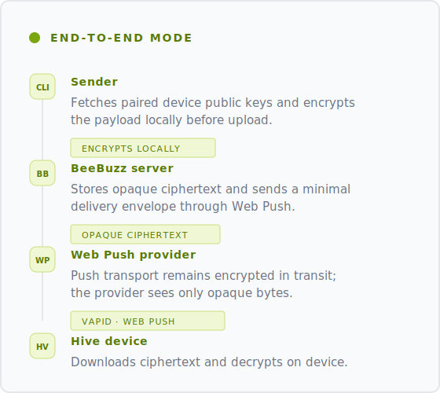
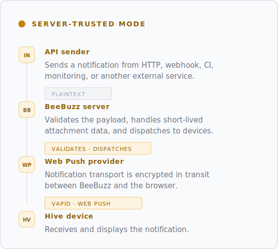

<div align="center">
    
</div>

<h1 align="center">Your tools. Your notifications. Your keys.</h1>

<p align="center">
  End-to-end encrypted delivery first. Trusted delivery when needed.
</p>

BeeBuzz is a focused push delivery system for private machine-to-person notifications from
servers, automations, scripts, apps, and webhooks.

It is built for developers, homelabbers, and small teams sending notifications from
systems they control. Not chat, not a team inbox, not a general messaging
platform.

It supports two delivery modes:

- **End-to-end encrypted delivery** for senders you control, when they can encrypt before sending to BeeBuzz and BeeBuzz stores only ciphertext.
- **Trusted delivery** for fast HTTP, webhook, and third-party service integrations when they cannot encrypt before sending.

BeeBuzz is built around paired personal devices, short-lived delivery state, and
a small auditable stack: Go, SQLite, SvelteKit, Web Push, and Hive, its PWA
receiver.

## Quickstart Demo

Hosted beta flow, showing setup in BeeBuzz and delivery in Hive side by side.

<https://github.com/user-attachments/assets/edcd0981-119a-47e8-a947-91c70f888782>

<p align="center">
  Sign in, create a pairing code, pair Hive, create a token, and deliver the first notification.
</p>

## BeeBuzz.app

[BeeBuzz.app](https://beebuzz.app) is the hosted BeeBuzz SaaS.

Hosted access is currently a beta for approved users. Hosted access is free
during beta. After beta, the hosted service is expected to
move to a single paid plan so the project can stay sustainable. Self-hosting
remains free, open source, and available under the AGPL license.

Start here: [BeeBuzz quickstart](https://beebuzz.app/docs/quickstart).

## How It Works

BeeBuzz has two delivery paths because not every sender can encrypt before
sending to BeeBuzz.

<table>
  <tr>
    <td width="50%" valign="top">
      
    </td>
    <td width="50%" valign="top">
      
    </td>
  </tr>
</table>

In both paths, Web Push transport is encrypted in transit between BeeBuzz and
the receiving browser. The difference is what BeeBuzz handles before delivery.
In trusted delivery, BeeBuzz receives the message, prepares delivery, handles
short-lived attachment data when present, and dispatches the notification to
paired devices. In end-to-end encrypted delivery, BeeBuzz stores ciphertext and
relays a minimal delivery envelope while Hive fetches and decrypts the message
on the receiving device.

## Try It

Use trusted mode when the sender cannot encrypt before sending:

```bash
curl https://push.beebuzz.app \
  -H "Authorization: Bearer $TOKEN" \
  -F title="Hello from BeeBuzz" \
  -F body="Trusted mode test"
```

Install the CLI from a [GitHub release](https://github.com/lucor/beebuzz/releases)
or with Go:

```bash
go install lucor.dev/beebuzz/cmd/beebuzz@latest
```

Then connect the CLI and send an encrypted notification:

```bash
beebuzz connect
beebuzz send "Hello from BeeBuzz"
```

In E2E mode, the CLI fetches paired device public keys, encrypts the payload
locally with [age](https://age-encryption.org), and sends ciphertext as
`application/octet-stream`. Hive fetches and decrypts the notification on the
receiving device.

## What's Inside

- **Server**: Go + SQLite API for accounts, topics, API tokens, devices, attachments, and Web Push dispatch.
- **Site**: SvelteKit web app for sign-in, device pairing, API tokens, webhook setup, and administration.
- **Hive**: PWA receiver that handles Web Push, stores pairing state locally, and decrypts E2E notifications on-device.
- **CLI**: sender for end-to-end encrypted notifications from terminals, scripts, and automation.

## Documentation

- [Quickstart](https://beebuzz.app/docs/quickstart)
- [Browser support](https://beebuzz.app/docs/browser-support)
- [Local development](https://beebuzz.app/docs/local-dev)
- [Webhooks](https://beebuzz.app/docs/webhooks)
- [E2E encryption model](docs/E2E_ENCRYPTION.md)
- [Threat model](docs/THREAT_MODEL.md)
- [OpenAPI contract](docs/openapi.yaml)
- [Development posts](https://lucor.dev/tags/beebuzz)

## Project Status

BeeBuzz is currently optimized for two workflows:

1. get approved for the hosted beta and send your first notification quickly
2. run the stack locally with a fast development loop

Detailed production self-hosting docs will come later.

## License

BeeBuzz is licensed under the GNU Affero General Public License v3.0 only. See
[LICENSE](LICENSE).

Third-party dependencies are tracked in the Go and frontend dependency manifests.
