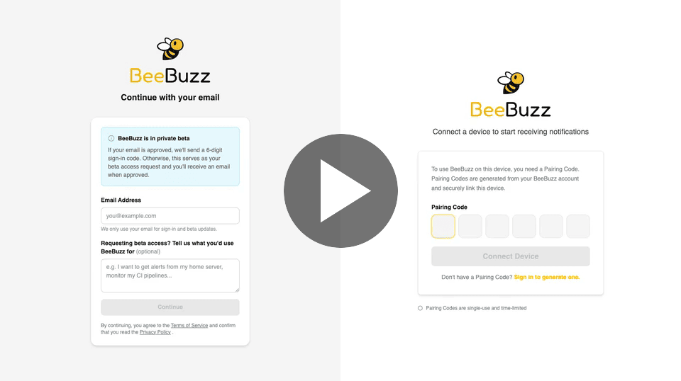

<div align="center">
    
</div>

<h1 align="center">Minimalist, privacy-first push notifications.</h1>

BeeBuzz sends notifications from your tools to your devices.

No app stores, no native apps: just the Hive PWA in your browser.

Use end-to-end encryption when possible, or trusted delivery when needed.

**Your tools. Your notifications. Your keys.**

## Quickstart Demo

Hosted beta flow, showing setup in BeeBuzz and delivery in Hive side by side.

<a href="https://codeberg.org/beebuzz/beebuzz/raw/branch/main/docs/assets/readme/demo.mp4"></a>

<p align="center">
  Sign in, create a pairing code, pair Hive, create a token, and deliver the first notification.
</p>

## Built for tools that need to reach you

For developers, homelabbers, and small teams sending notifications from systems they control. Not chat, not a team inbox, not a general messaging platform.

- **Servers & homelabs** — notifications from servers, routers, backups, and cron jobs. Use the CLI or Go SDK.
- **Scripts & CI/CD** — notifications from scripts, deployments, and pipelines. Use webhooks, cURL, or the HTTP API.
- **Home Assistant** — connect automations and alerts to BeeBuzz with a dedicated integration.

## How delivery works

Two delivery modes, chosen by one question: can the sender encrypt before it talks to BeeBuzz?

<table>
  <tr>
    <td width="50%" valign="top">
      
    </td>
    <td width="50%" valign="top">
      
    </td>
  </tr>
</table>

**End-to-end encrypted delivery** (recommended). The sender encrypts locally. BeeBuzz stores ciphertext only and never sees the content. **BeeBuzz can't read the message.**

**Trusted delivery** (when needed). The sender sends plaintext. BeeBuzz reads to route, then delivers to your devices. **BeeBuzz can read the message to prepare delivery.**

In both modes, Web Push transport is encrypted in transit between BeeBuzz and the receiving browser.

## BeeBuzz.app

[BeeBuzz.app](https://beebuzz.app) is the hosted BeeBuzz SaaS.

Hosted access is currently a beta for approved users and is free during beta. After beta, the hosted service is expected to move to a single paid plan so the project can stay sustainable. Self-hosting remains free, open source, and available under the AGPL license.

Start here: [BeeBuzz quickstart](https://beebuzz.app/docs/quickstart).

## Try It

Use trusted mode when the sender cannot encrypt before sending:

```bash
curl https://push.beebuzz.app \
  -H "Authorization: Bearer $TOKEN" \
  -F title="Hello from BeeBuzz" \
  -F body="Trusted mode test"
```

Install the CLI from the [latest release](https://codeberg.org/beebuzz/cli/releases)
or with Go:

```bash
go install go.beebuzz.app/cli@latest
```

Then connect the CLI and send an encrypted notification:

```bash
beebuzz connect
beebuzz send "Hello from BeeBuzz"
```

In E2E mode, the CLI fetches paired device public keys, encrypts the payload
locally with [age](https://age-encryption.org), and sends ciphertext as
`application/octet-stream`. Hive fetches and decrypts the notification on the
receiving device.

## What's in this repo

- **Server**: Go + SQLite API for accounts, topics, API tokens, devices, attachments, and Web Push dispatch.
- **Site**: SvelteKit web app for sign-in, device pairing, API tokens, webhook setup, and administration.
- **Hive**: PWA receiver that handles Web Push, stores pairing state locally, and decrypts E2E notifications on-device.

## Companion projects

- [**beebuzz-go**](https://codeberg.org/beebuzz/beebuzz-go) — public Go SDK for the BeeBuzz HTTP API.
- [**cli**](https://codeberg.org/beebuzz/cli) — `beebuzz` CLI for sending end-to-end encrypted notifications from terminals, scripts, and automation.
- [**home-assistant**](https://codeberg.org/beebuzz/home-assistant) — HACS integration for Home Assistant.

## Documentation

- [Quickstart](https://beebuzz.app/docs/quickstart)
- [Browser support](https://beebuzz.app/docs/browser-support)
- [Local development](https://beebuzz.app/docs/local-dev)
- [Webhooks](https://beebuzz.app/docs/webhooks)
- [E2E encryption model](docs/E2E_ENCRYPTION.md)
- [Threat model](docs/THREAT_MODEL.md)
- [OpenAPI contract](docs/openapi.yaml)
- [Development posts](https://lucor.dev/tags/beebuzz)

## Project Status

BeeBuzz is currently optimized for two workflows:

1. get approved for the hosted beta and send your first notification quickly
2. run the stack locally with a fast development loop

Detailed production self-hosting docs will come later.

## License

BeeBuzz is licensed under the GNU Affero General Public License v3.0 only. See
[LICENSE](LICENSE).

Third-party dependencies are tracked in the Go and frontend dependency manifests.
