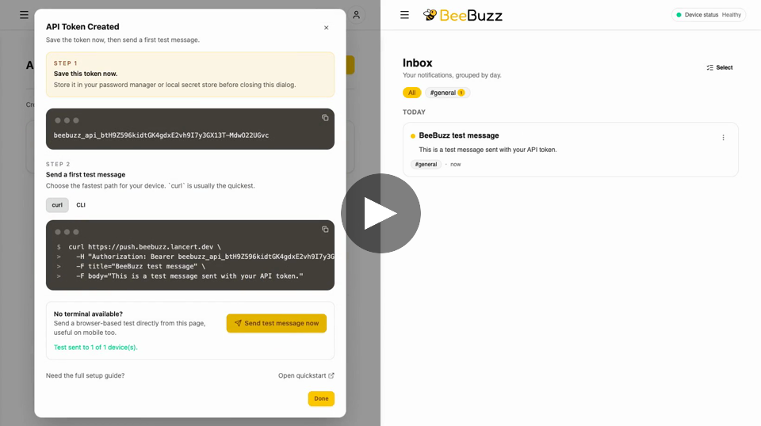
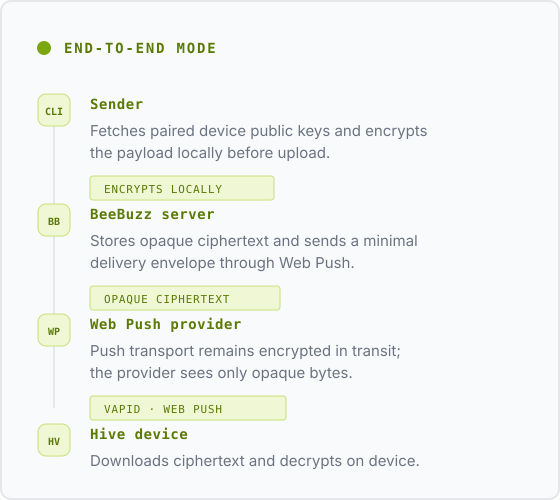
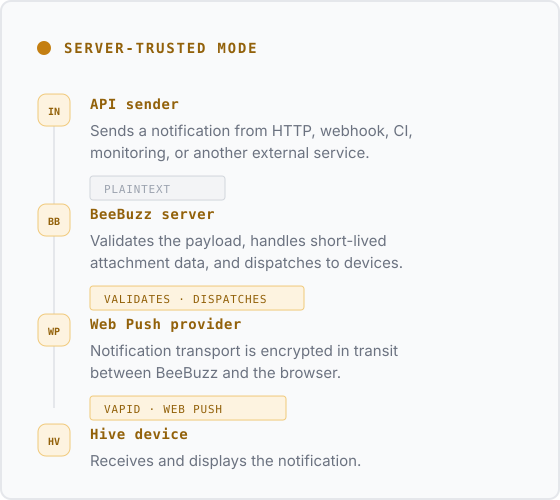

<div align="center">
    
</div>

<h1 align="center">Private alerts from your tools to you</h1>
BeeBuzz brings alerts from your projects, smart home, and online services into one focused inbox on your devices.

Supported tools encrypt alerts before sending, so only your paired devices can read them.
For services that connect directly, trusted delivery keeps setup simple.

## Quickstart Demo

Hosted flow, showing setup in BeeBuzz and delivery in Hive side by side.

<a href="https://codeberg.org/beebuzz/beebuzz/raw/branch/main/docs/assets/readme/demo.mp4" target="_blank" rel="noreferrer"></a>

<p align="center">
  Sign in, create a pairing code, pair Hive, create a token, and deliver the first notification.
</p>

## Built for tools that need to reach you

For developers, homelabbers, and small teams sending notifications from systems they control. Not chat, not a team inbox, not a general messaging platform.

- **Servers & homelabs** — notifications from servers, routers, backups, and cron jobs. Use the CLI or Go SDK.
- **Scripts & CI/CD** — notifications from scripts, deployments, and pipelines. Use webhooks, cURL, or the HTTP API.
- **Home Assistant** — connect automations and alerts to BeeBuzz with a dedicated integration.

## How delivery works

Two delivery modes, chosen by one question: can the sender encrypt before it talks to BeeBuzz?

<table>
  <tr>
    <td width="50%" valign="top">
      
    </td>
    <td width="50%" valign="top">
      
    </td>
  </tr>
</table>

**End-to-end encrypted delivery** (recommended). The sender encrypts locally. BeeBuzz stores ciphertext only and never sees the content. **BeeBuzz can't read the message.**

**Trusted delivery** (when needed). The sender sends plaintext. BeeBuzz reads to route, then delivers to your devices. **BeeBuzz can read the message to prepare delivery.**

In both modes, Web Push transport is encrypted in transit between BeeBuzz and the receiving browser.

## BeeBuzz.app

[BeeBuzz.app](https://beebuzz.app) is the hosted BeeBuzz SaaS.

Hosted access has Free and Hosted plans. Self-hosting remains free, open source, and available under the AGPL license.

Start here: [BeeBuzz quickstart](https://docs.beebuzz.app/quickstart/).

## Try It

Use trusted mode when the sender cannot encrypt before sending:

```bash
curl https://push.beebuzz.app \
  -H "Authorization: Bearer $TOKEN" \
  -F title="Hello from BeeBuzz" \
  -F body="Trusted mode test"
```

Install the CLI from the [latest release](https://codeberg.org/beebuzz/cli/releases)
or with Go:

```bash
go install go.beebuzz.app/cli/cmd/beebuzz@latest
```

Then connect the CLI and send an encrypted notification:

```bash
beebuzz connect
beebuzz send "Hello from BeeBuzz"
```

In E2E mode, the CLI fetches paired device public keys, encrypts the payload
locally with [age](https://age-encryption.org), and sends ciphertext as
`application/octet-stream`. Hive fetches and decrypts the notification on the
receiving device.

## What's in this repo

- **Server**: Go + SQLite API for accounts, plans and billing, topics, API tokens, devices, webhooks, attachments, and Web Push dispatch.
- **Dashboard**: SvelteKit account and administration app for sign-in, plan usage and billing, device pairing, API tokens, and webhook setup.
- **Hive**: PWA receiver that handles Web Push, stores pairing state locally, and decrypts E2E notifications on-device.

## Companion projects

- [**beebuzz-go**](https://codeberg.org/beebuzz/beebuzz-go) — public Go SDK for the BeeBuzz HTTP API.
- [**cli**](https://codeberg.org/beebuzz/cli) — `beebuzz` CLI for sending end-to-end encrypted notifications from terminals, scripts, and automation.
- [**home-assistant**](https://codeberg.org/beebuzz/home-assistant) — HACS integration for Home Assistant.

## Documentation

- [Quickstart](https://docs.beebuzz.app/quickstart/)
- [Browser support](https://docs.beebuzz.app/browser-support/)
- [Local development](https://docs.beebuzz.app/local-dev/)
- [Webhooks](https://docs.beebuzz.app/webhooks/)
- [E2E encryption model](docs/E2E_ENCRYPTION.md)
- [Threat model](docs/THREAT_MODEL.md)
- [OpenAPI contract](docs/openapi.yaml)
- [Development posts](https://lucor.dev/tags/beebuzz)

## Project Status

BeeBuzz is currently optimized for two workflows:

1. use the hosted service and send your first notification quickly
2. run the stack locally with a fast development loop

Detailed production self-hosting docs will come later.

## License

BeeBuzz is licensed under the GNU Affero General Public License v3.0 only. See
[LICENSE](LICENSE).

Third-party dependencies are tracked in the Go and frontend dependency manifests.
