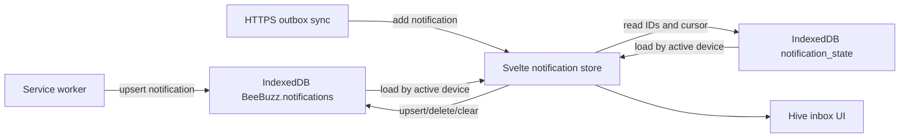
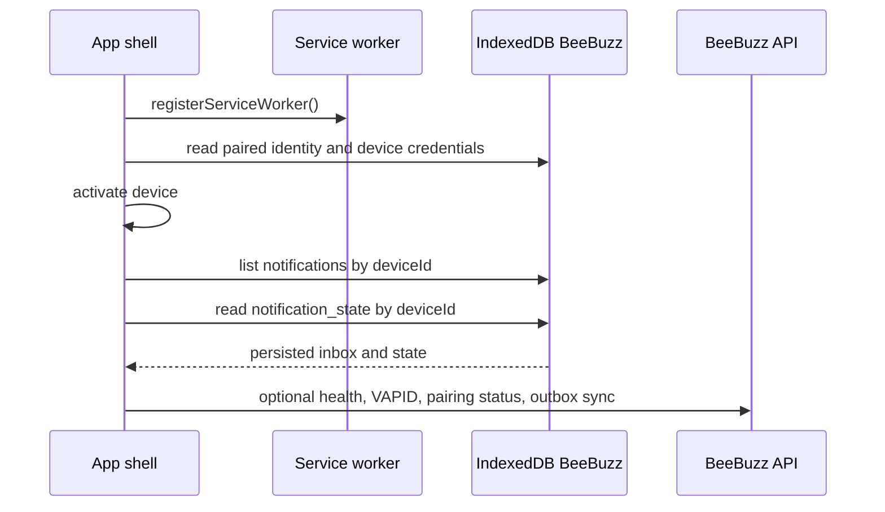
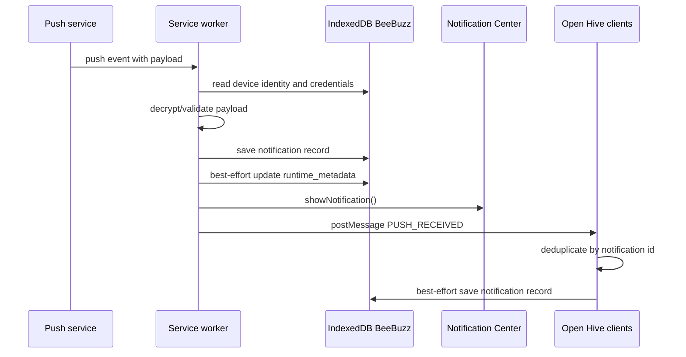
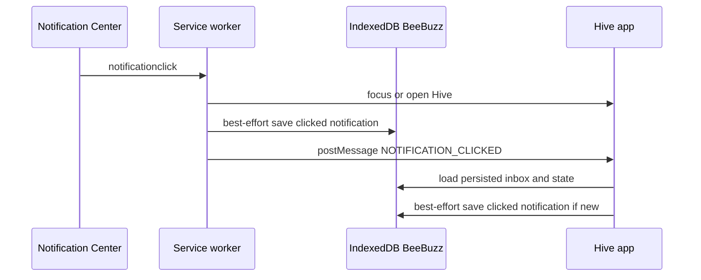
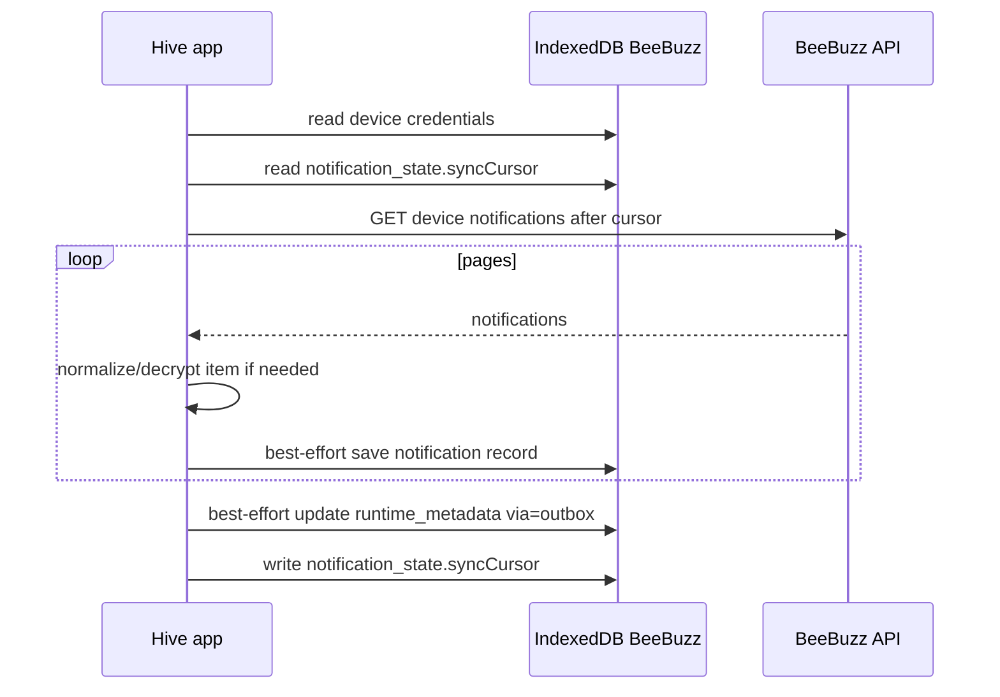
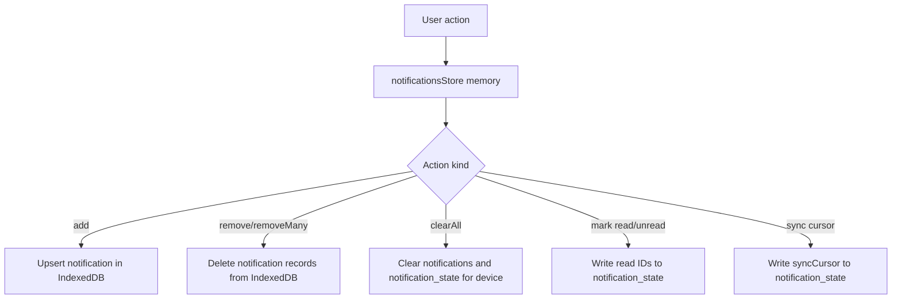
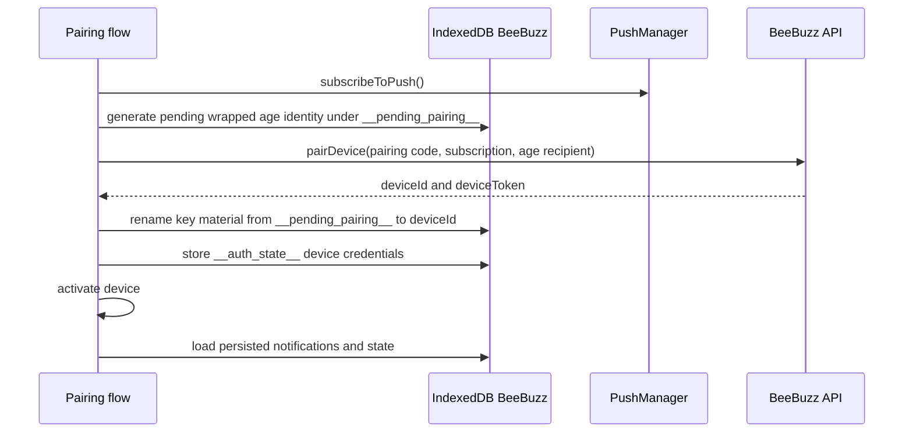
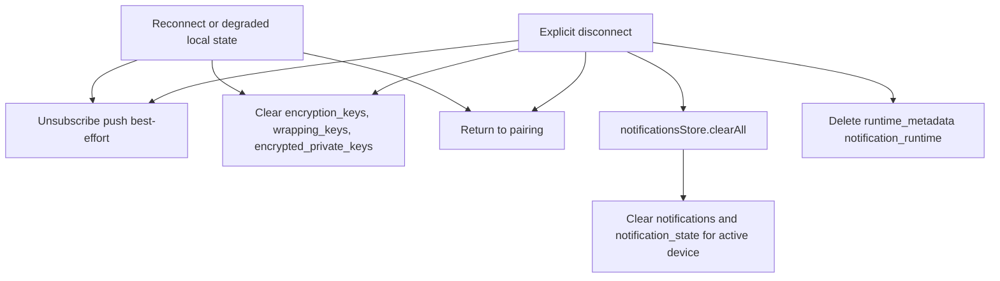
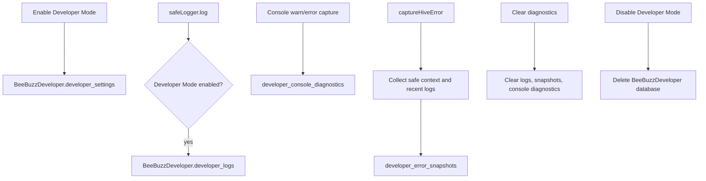

# Hive Storage Architecture

This document maps the Hive browser-storage flows with IndexedDB as the inbox
source of truth. It is intended as a review aid for future storage changes.

## Storage Inventory

### IndexedDB: `BeeBuzz`

Defined in `web/apps/hive/src/lib/services/hive-db.ts`.

| Store                    | Key                        | Data                                                              | Writers                                                                       | Readers                                                          | Cleanup                                           | Role                                                                      |
| ------------------------ | -------------------------- | ----------------------------------------------------------------- | ----------------------------------------------------------------------------- | ---------------------------------------------------------------- | ------------------------------------------------- | ------------------------------------------------------------------------- |
| `notifications`          | `id`                       | Notification records scoped by `deviceId`, with `by-device` index | Service worker push/click handlers, app foreground imports, HTTPS outbox sync | App shell through `notificationsStore.loadFromIndexedDB`         | Explicit delete, bulk delete, device disconnect   | Source of truth for Hive inbox history                                    |
| `notification_state`     | `deviceId`                 | Read notification IDs, outbox sync cursor, update timestamp       | Inbox read/unread operations, outbox sync cursor updates                      | App shell and outbox sync                                        | Device disconnect / clear state                   | Source of truth for per-device inbox state                                |
| `encryption_keys`        | key id or `__auth_state__` | Public key metadata and device credentials                        | Pairing/finalization through `deviceKeysRepository`; device credential write  | Pairing checks, service worker decrypt path, device status, sync | `deleteAllKeys` / `deviceKeysRepository.clearAll` | Source of truth for local device identity metadata and device credentials |
| `wrapping_keys`          | key id                     | Non-extractable AES-GCM wrapping `CryptoKey`                      | Pairing key generation                                                        | Encryption/decryption identity load                              | `deleteAllKeys` / `deviceKeysRepository.clearAll` | Source of truth for wrapped age identity protection                       |
| `encrypted_private_keys` | key id                     | Wrapped X25519 private key bytes and IV                           | Pairing key generation                                                        | Encryption/decryption identity load                              | `deleteAllKeys` / `deviceKeysRepository.clearAll` | Source of truth for local decrypt identity                                |
| `runtime_metadata`       | `notification_runtime`     | Last notification received timestamp and transport                | Push handler and outbox sync, best-effort                                     | Developer context/report collection                              | Device disconnect                                 | Technical diagnostics metadata                                            |

`openHiveDB()` requests schema version `4` and can upgrade stores.
`openExistingHiveDB()` opens the current database version without forcing an
upgrade; service-worker paths use it where push delivery must not depend on a
blocked upgrade.

### IndexedDB: `BeeBuzzDeveloper`

Defined in `web/apps/hive/src/lib/devmode/storage.ts`.

| Store                           | Key              | Data                                          | Writers                       | Readers                                    | Cleanup                                               | Role                                   |
| ------------------------------- | ---------------- | --------------------------------------------- | ----------------------------- | ------------------------------------------ | ----------------------------------------------------- | -------------------------------------- |
| `developer_settings`            | `developer_mode` | Developer Mode enabled flag                   | Developer Mode toggle         | App bootstrap and toggle                   | Delete developer database                             | Local diagnostics opt-in               |
| `developer_logs`                | `id`             | Safe diagnostic events                        | `safeLogger` while enabled    | Developer page and error snapshot assembly | Max-event pruning, clear diagnostics, delete database | Local diagnostic log buffer            |
| `developer_error_snapshots`     | `id`             | Safe error snapshots with recent logs/context | `captureHiveError`            | Developer page/report submission           | Max-event pruning, clear diagnostics, delete database | Local manually submitted error context |
| `developer_console_diagnostics` | `id`             | Console warning/error diagnostics             | Console capture while enabled | Developer page/report submission           | Max-entry pruning, clear diagnostics, delete database | Local console diagnostic buffer        |

Developer diagnostics are local-only and opt-in. Disabling Developer Mode deletes
the `BeeBuzzDeveloper` database.

### IndexedDB: `BeeBuzzEncryptionProbe`

Defined in `web/apps/hive/src/lib/services/encryption-diagnostics.ts`.

| Store      | Key          | Data                     | Writers                      | Readers                      | Cleanup                      | Role                               |
| ---------- | ------------ | ------------------------ | ---------------------------- | ---------------------------- | ---------------------------- | ---------------------------------- |
| `key_only` | probe key id | Probe `CryptoKey` values | Encryption diagnostics probe | Encryption diagnostics probe | Store clear before scenarios | Temporary browser capability probe |

### `localStorage`

Hive does not use `localStorage` for inbox storage. Current non-inbox keys:

| Key            | Data                    | Writers            | Readers                                                 | Cleanup                  | Role                                                                                      |
| -------------- | ----------------------- | ------------------ | ------------------------------------------------------- | ------------------------ | ----------------------------------------------------------------------------------------- |
| `bb_installed` | `"true"` install marker | PWA install helper | Onboarding install-platform detection                   | No explicit cleanup      | Small UI hint                                                                             |
| `login_state`  | Auth request state      | Shared auth login  | Shared auth verification flow/backend callback handling | Verify/logout/clear auth | Dashboard/shared auth state; may exist on Hive origin only if shared auth flow runs there |

### `sessionStorage`

| Key           | Data                           | Writers           | Readers          | Cleanup                  | Role                                                 |
| ------------- | ------------------------------ | ----------------- | ---------------- | ------------------------ | ---------------------------------------------------- |
| `login_email` | Email used during auth request | Shared auth login | Shared auth flow | Verify/logout/clear auth | Dashboard/shared auth hint; not part of Hive pairing |

## Current Notification Architecture

IndexedDB is the notification source of truth:

The Svelte store remains the foreground view model. Its mutating operations update
memory synchronously for UI responsiveness and persist to IndexedDB best-effort.
Storage failures are captured in `notificationsStore.storageError`; quota failures
are normalized as `StorageQuotaError`.

## Main Flows

### App Bootstrap

### Service Worker Push

If no client is open, the IndexedDB record waits until app startup or foreground
polling loads it.

### Notification Click

The click path persists before the fallback postMessage so iOS/WebKit cold-launch
drops can still be recovered.

### HTTPS Outbox Sync

### Inbox User Actions

### Pairing And Device Identity

Key material is consistently stored in IndexedDB:

- `encryption_keys` holds public metadata and `__auth_state__`.
- `wrapping_keys` holds the AES-GCM wrapping key.
- `encrypted_private_keys` holds wrapped X25519 private-key bytes.

### Cleanup, Reconnect, Disconnect

Explicit disconnect clears IndexedDB inbox state, runtime metadata, and key
material. Reconnect cleanup clears push subscription and key material.

### Developer Mode

Service worker diagnostics are sent to app clients through `postMessage`; the
service worker does not write Developer Mode logs directly to avoid IndexedDB
contention.

## Storage-Full Behavior

IndexedDB can still hit browser quota. Hive handles this at repository boundaries:

- IndexedDB quota failures are normalized to `StorageQuotaError`.
- Foreground store mutations keep the in-memory notification state when persistence
  fails and expose `notificationsStore.storageError`.
- Service-worker push handling already treats notification persistence as
  best-effort: it records `notification.persist_failed` and still shows the OS
  notification.
- Hive does not apply automatic retention yet. The inbox keeps records until the
  user deletes notifications or disconnects the device.

## Review Checklist

Use this checklist when changing storage code:

- Every stored record has a named owner and a documented lifetime.
- Every persistent write has expected quota/error behavior.
- Service-worker writes do not require a blocking schema upgrade.
- App-shell imports are idempotent across restart, refresh, duplicate postMessage,
  and outbox sync.
- The source of truth for inbox history remains IndexedDB.
- Large payloads and inline attachment data have a product decision before any
  automatic retention is added.
- Local device credentials and private-key material never move to localStorage.
- Reconnect, failed pairing, explicit disconnect, and account-side unpair have
  consistent local cleanup semantics.
- Schema upgrades preserve push delivery during staged rollouts with old app tabs.
- Developer Mode storage remains opt-in, bounded, and separately deletable.
